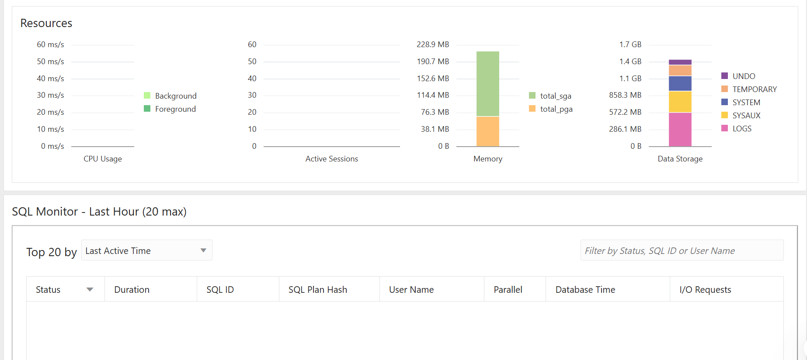

# 🧠 Assignment II: Database Creation, Deletion & OEM

👨‍🎓 **Name:** Rukundo Levis  
🆔 **Student ID:** 27507 
📚 **Course:** Database Development with PL/SQL  
🏫 **Institution:** AUCA  
📅 **Date:**16 February 2025  

---

## 📘 Introduction

This project demonstrates the management of Oracle 21c **Multitenant Databases**, including how to:
- ✅ Create a new **Pluggable Database (PDB)**
- 🗑️ Create and **Delete another PDB**
- ⚙️ Configure and access **Oracle Enterprise Manager (OEM)**

These exercises strengthen practical skills in **database creation, configuration, and monitoring**, essential for any PL/SQL developer or DBA.

---

## ⚙️ Task 1: Create a New Pluggable Database (PDB)

### 🎯 Objective
Create a PDB following the format:
```
(FirstTwoLettersOfFirstName)_pdb_(StudentID)
```

**Example:** `le_pdb_27507`

### 🧾 Steps
1. Connected to **SQL*Plus** as SYSDBA.
   ```sql
   sqlplus / as sysdba;
   ```
2. Verified the connection:
   ```sql
   SHOW CON_NAME;
   ```
3. Created the PDB:
   ```sql
   CREATE PLUGGABLE DATABASE le_pdb_27507 
     ADMIN USER levis_PLSQL_27507 IDENTIFIED BY "levis123"
     ROLES = (DBA)
     FILE_NAME_CONVERT = ('C:\oraclexe\oradata\ORCL2021\pdbseed\', 
                          'C:\oraclexe\oradata\ORCL2021\le_pdb_27507\');
   ```


### ✅ Result
- Successfully created and opened the new PDB `le_pdb_27507`.
- Created the admin user `levis_PLSQL_27507`.

📸 **Screenshot:** PDB Creation  


---

## 🗑️ Task 2: Create and Delete a PDB

### 🎯 Objective
Create and delete another PDB using the format:
```
(FirstTwoLettersOfFirstName)_to_delete_pdb_(StudentID)
```

**Example:** `le_to_delete_pdb_27507`

### 🧾 Steps
1. Created the PDB:
   ```sql
   CREATE PLUGGABLE DATABASE le_to_delete_pdb_27507 
     ADMIN USER levis_PLSQL_27507 IDENTIFIED BY "levis123"
     ROLES = (DBA)
     FILE_NAME_CONVERT = ('C:\oraclexe\oradata\ORCL2021\pdbseed\', 
                          'C:\oraclexe\oradata\ORCL2021\le_to_delete_pdb_27507\');
   ```

2. Deleted the PDB and its datafiles:
   ```sql
   DROP PLUGGABLE DATABASE le_to_delete_pdb_27507 INCLUDING DATAFILES;
   ```

### ✅ Result
- The test PDB was successfully created and then deleted.

📸 **Screenshot:** PDB Deletion  


---

## 🧩 Task 3: Oracle Enterprise Manager (OEM)

### 🎯 Objective
Access and configure **Oracle Enterprise Manager Express (OEM)** for the created PDB.

### 🧾 Steps
1. Switched to the CDB root:
   ```sql
   ALTER SESSION SET CONTAINER = CDB$ROOT;
   ```
2. Confirmed the pluggable databases:
   ```sql
   SHOW PDBS;
   ```
   Result:
   ```
   5 le_pdb_27507 READ WRITE NO
   ```
3. Switched to the new PDB:
   ```sql
   ALTER SESSION SET CONTAINER = le_pdb_27507;
   ```
4. Enabled HTTPS port for EM Express:
   ```sql
   EXEC DBMS_XDB_CONFIG.SETHTTPSPORT(5501);
   ```
5. Verified the HTTPS port:
   ```sql
   SELECT DBMS_XDB_CONFIG.GETHTTPSPORT FROM DUAL;
   ```
6. Unlocked the PDB admin user:
   ```sql
   ALTER USER levis_PLSQL_27507 IDENTIFIED BY "levis123" ACCOUNT UNLOCK;
   ```
7. Opened OEM in browser:
   ```
   https://localhost:5501/em?target=le_pdb_27507
   ```
8. Logged in as:
   ```
   Username: levis_PLSQL_27507
   Password: levis123
   ```

### ✅ Result
- OEM successfully opened and displayed the dashboard for `le_pdb_27507`.

📸 **Screenshot:** OEM Dashboard  



---

## ⚠️ Issues & Solutions

| Issue | Cause | Solution |
|-------|--------|-----------|
| ❌ *Invalid Database Credentials* | OEM connected to wrong service (`orcl2021`) | Opened correct PDB (`le_pdb_27507`) and re-enabled port 5501 |
| ⚙️ *ORA-65040: Operation not allowed* | Tried setting service name inside PDB | Ran the command from `CDB$ROOT` |
| 🔒 *SSL Warning in Browser* | OEM uses self-signed certificate | Continued using “Advanced → Proceed” |

---

## 🧠 Conclusion

Through this assignment, I successfully:
- Created and managed multiple **Pluggable Databases (PDBs)**.  
- Configured and accessed **Oracle Enterprise Manager (OEM)**.  
- Solved typical Oracle 21c multitenant environment issues.  

This project strengthened my practical DBA skills and provided a deeper understanding of **PDB lifecycle management** and **Oracle container architecture**.

---

